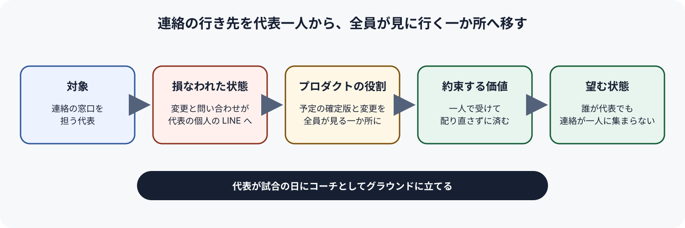
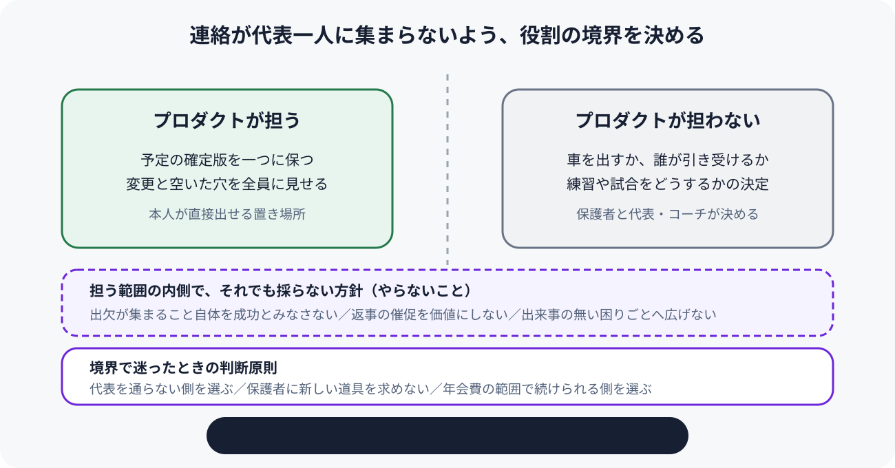

# Product North Star — ひばりが丘FC のクラブの連絡

ひばりが丘FC の予定とその変更が代表の個人の LINE 一つに集まり、代表が平日の夜と試合の前夜を連絡に削られている状態を、予定と変更が全員の見に行く一か所で回り、誰が代表を務めても連絡が一人に集まらず、代表が試合の日にコーチとしてグラウンドに立てる状態へ変える。

この文書は、2026-09-27 に代表から聞いた出来事と、前の段の課題と価値仮説の資料に基づく。代表と、手伝いを申し出ている知り合いのエンジニアは、何かを作るか、どの困りごとまで扱うか、保護者に何を頼むかを決めるとき、ここへ戻って判断原則と境界を照合する。依頼は出欠アプリ、当番の割り振り、会費の集金として届いたが、この文書はどの手段を採るかを決めない。いまの障害にどの順で取り組むか、何をいつまでに作るか試すかは Product Strategy で決める。受益者と判断原則の一部は代表がまだ判断しておらず、推奨を仮に置いている。どこが仮置きかは各節と「未決」に書いた。

## 対象

### 価値を受け取る人 — 連絡の窓口を担う代表（仮置き）

価値を第一に受け取る人を、ひばりが丘FC で予定を配り、変更を受け、代わりを手配する窓口の役、つまり今の代表と、いずれその役を引き継ぐ人に仮に置く。クラブは小学生40人（1〜6年生）、35家庭で、代表を含むコーチ3人は保護者のボランティアである。代表は会社員で、平日の日中はクラブの連絡に時間を使えない。

保護者とコーチは、代表から移した連絡を受け持つ相手であり、その手間を増やしてはならない相手として「両立させる価値」に置く。子どもがサッカーを楽しむことは、代表がグラウンドに立ちたい理由として依頼にあるが、プロダクトが直接約束する価値には入れない。この置き方は代表がまだ判断していない（「未決」の「第一の受益者は代表でよいか」）。

### その人が置かれた場面

価値が損なわれるのは、練習や試合の前日の夜から当日の朝にかけて、欠席、車の変更、集合時間の問い合わせが代表の個人の LINE へ別々に届く場面である。練習は土曜の午前、試合は月に2回ほど日曜にあり、遠征は月に2回ほどで、そのたびに保護者の車の配車が要る。雨で練習を中止するときのように、代表が決めたことを早朝に全家庭へ届けなければならない場面でも、同じことが起きる。

## 望む状態

### 現在損なわれている状態

クラブの予定とその変更には、全員が見に行く決まった置き場所が無い。LINE グループに流した情報はほかの話題で流れ、確かめたい人も変えたい人も、確実に届く代表の個人の LINE へ送る。その結果、変更を受け、代わりの車を探し、作り直した表を配り直し、同じ問い合わせに答え直す役が代表一人に集まる。2026-09-19 の夜、代表は三家庭からの変更を受けて23時すぎから一軒ずつ車を頼み、配車表を流し直したのは午前0時40分ごろだった。翌日の試合中も、前半のあいだ翌週の配車表の下書きをしていた。

この回し方は代表個人の頑張りに支えられており、代表は、いつか役を引き継ぐときに今のやり方をそのまま渡せる自信が無いと話している。

### 実現したい状態

予定の確定版と、そこへの変更が、全員の見に行く一か所にあり、保護者とコーチは確かめたいことをそこで確かめ、変えたいことを本人がそこへ出す。車が足りなくなったことも全員に見え、代表が一軒ずつ頼まなくても穴が埋まる。代表は試合の前夜に一人で組み直さずに眠れ、試合の日にはコーチとしてグラウンドに立てる。この回し方が特定の代表の頑張りではなくクラブの仕組みとして残るので、代表が替わってもそのまま引き継げる。

## 約束する価値

### 代表が、変更を一人で受けて配り直さずに済む

もっとも重要な価値は、代表が前日から当日の朝にかけて、欠席、車の変更、集合時間の問い合わせを自分の個人の LINE で一人で受け、代わりを手配し、配り直さずに済むことである。届いたかどうかは、前日18時以降に代表の個人の LINE へ届くクラブの連絡の件数と、代表が前日に配車表を作り直した回数の減り方で観測する。この二つは進み具合を見る信号であり、件数を減らすこと自体を目的にはしない。保護者が代表へ送るのをやめても、代表以外の誰か一人に同じ役が移っただけなら、価値は届いていない。

### 保護者とコーチに、今より重い手間を求めない

代表から連絡を移そうとすると、保護者とコーチに新しい手順や道具を求めたくなる。しかし35家庭のボランティアのクラブで、保護者が変更を一か所へ出してくれるかは、この価値のもっとも危うい前提である。そこで、代表を楽にすることと、保護者とコーチが今と同じくらいの手軽さで確かめ、出せることを両立させる。代表は、この春に市販の出欠アプリを三つ調べたが、保護者に入れてもらう手間を考えて入れなかった。届いたかどうかは、変更が決まった一か所と代表の個人の LINE のどちらに届いたかの割合で観測する。

## プロダクトの役割

### このプロダクトが担うこと

練習や試合ごとに、集合時間、場所、配車を載せた予定の確定版を一つに保ち、欠席や車の変更を本人が直接そこへ出せるようにし、変更と、それで空いた穴を全員に見えるようにすることを担う。誰かに聞かなくても確定版を見れば分かる状態と、変更が代表の個人の LINE を通らずに全員へ届く状態を、一貫して引き受ける。

### このプロダクトが担わないこと

車を出すか、空いた穴を誰が引き受けるかを決めるのは保護者であり、練習の中止や試合の予定を決めるのは代表とコーチである。プロダクトはそれらを決めず、決まったことと決める必要があることを全員に見せるところまでを担う。LINE グループは全家庭が入っており、代表は今後も使い続けるつもりである。クラブの連絡の場そのものを置き換えることは担わない。

## 進め方

最初の3か月は LINE のノートで確定版を試し、10月末までに保護者の8割がノートへ変更を出す状態を目標にする。次の3か月で、知り合いのエンジニアが月に数時間ずつ出欠と配車のアプリを作り、来年の4月に全家庭へ配る。

## 判断原則 — 迷ったら、連絡が代表を通らない側を選ぶ

### 代表の処理を速くするか、代表を通らずに済ませるか（仮置き）

代表が受けた連絡を速く楽に処理できるようにする案と、連絡がそもそも代表を通らずに済む案で迷ったら、代表を通らずに済む側を優先し、窓口を代表一人に固定したまま処理を速くする案は選ばない。処理を速くしても行き先が代表のままなら、前夜の組み直しと見落としは代表に残り、引き継ぐときにも同じ負担を渡すことになるためである。代表がこの二択を判断したことはなく、推奨を仮に置いている。

### 確実に集める仕組みか、保護者が今のまま使える手軽さか

保護者にとっての使いやすさを大切にし、みんなが気持ちよく使えるプロダクトにする。

### 便利さのための継続費用か、年会費の範囲で続けられることか

より便利になる有料のサービスと、年会費の範囲で続けられるやり方で迷ったら、続けられる側を選び、毎月の利用料がかかる案は選ばない。クラブのお金は1家庭あたり年1万2千円の年会費だけで、グラウンド代、保険、用具で使い切っており、代表は有料のサービスに毎月払う余裕は無いと話している。払い続けられなければ、代表が替わったときに回し方が途切れる。

## やらないこと

### 出欠が集まること自体を成功とみなさない

出欠をボタン一つで集められても、車の穴を埋める手間、作り直した表を行き渡らせる手間、流れた集合時間の問い合わせが代表に残るなら、目指す状態には入れない。依頼の出発点は出欠アプリだったが、9月19日の夜の負担の大半は欠席の集約ではなく、その後の手配と配り直しだった。

### 保護者の返事を催促して速くすることを価値にしない

「保護者の返事が遅い」ことは出来事で裏付けられておらず、9月19日の三家庭は変更が起きたその夜のうちに連絡していた。遅れたのではなく、送り先が代表個人だった。返事を急がせる働きかけは、行き先が代表一人である状態を変えないので、このプロダクトが追う価値に入れない。これは代表が判断していない推奨の仮置きである（「未決」の「返事の催促を価値にしないでよいか」）。

### 出来事で確かめていない困りごとへ範囲を広げない

当番の割り振りと会費の集金は依頼にあったが、どちらも出来事が得られておらず、予定と変更の行き先が代表一人であることでは説明できない。確かめられるまでは担う範囲に入れない。これは代表が判断していない推奨の仮置きで、確かめられたら「見直し条件」に従って範囲を見直す。

## 根拠と仮説

### 観測したこと

#### 前夜の変更は、グループではなく代表の個人の LINE に届いた

2026-09-19（金）21時半すぎから23時ごろ、代表の個人の LINE に三家庭から別々に連絡が来た。二家庭は子どもの発熱で休む連絡、一家庭は仕事で車を出せなくなった連絡で、LINE グループには誰も書いていなかった。代表は23時すぎから一軒ずつ個人の LINE と電話で頼んで4軒目で引き受けてもらい、配車表を流し直したのは午前0時40分ごろだった。翌朝、流し直した表を見ていなかった家庭が1軒あり、出発が15分遅れた。翌日の試合の前半、代表はグラウンドの脇で翌週の配車表の下書きをしていた。（出典：代表の発言、観測時点：2026-09-27）

#### グループに流した情報を、代表が一人ずつ答え直していた

2026-09-08（火）の夜、コーチ1人と保護者2人から別々に個人の LINE で集合時間を聞かれた。集合時間はグループに流してあったが、ほかの話題で流れていた。代表がその夜クラブの連絡に使ったのはおよそ1時間半だった。（出典：代表の発言、観測時点：2026-09-27）

#### 個人の LINE に集まった連絡を、代表が見落としていた

2026-08-23（日）、代表は6時10分に練習中止をグループへ流したが、3家庭は見ずにグラウンドへ来た。うち1家庭は前の晩に個人の LINE で問い合わせており、代表はそれを見落としていた。（出典：代表の発言、観測時点：2026-09-27）

#### 保護者に新しいアプリを求めることを、代表は一度見送った

この春、代表は市販の出欠アプリを三つ調べたが、どれも有料で、保護者に入れてもらう手間を考えて入れなかった。LINE グループは全家庭が入っており、今後も使い続けるつもりである。（出典：grill での代表の回答、観測時点：2026-09-27）

#### 費用と引き継ぎ

クラブのお金は1家庭あたり年1万2千円の年会費だけで、グラウンド代、保険、用具で使い切っている。代表の任期は決まっておらず、来年度も続ける予定だが、いつかは誰かに引き継ぎたく、今のやり方をそのまま渡せる自信は無い。（出典：grill での代表の回答、観測時点：2026-09-27）

#### 行き先を一か所に決めれば、保護者はそこへ変更を出す

保護者は、置き場所が一か所に決まっていれば、欠席や車の変更を代表の個人の LINE ではなくそこへ出すことが分かっている。車が足りなくなれば、代表が頼まなくても出せる家庭が名乗り出る。（出典：代表の発言、観測時点：2026-09-27）

#### 価値仮説にまだ入らない観測

「保護者の返事が遅い」について、代表は直近の一回を思い出せず、締め切りを決めて告知したことも無い。当番の偏りは、この夏にどの家庭が何回やったかの記録が無い。集金の手間は、会計の保護者Bさんが夏合宿の打ち合わせの立ち話で言った「会費の集金、また現金で持ってきてない家があって」という一言だけである。保護者本人が9月19日や8月23日の出来事をどう受け止めたかは、まだ誰も聞いていない。（出典：代表の発言と grill での回答、観測時点：2026-09-27）

## 見直し条件

状況が大きく変わったら見直す。

## 未決

### 第一の受益者は代表でよいか（仮置き）

価値を第一に受け取る人を、連絡の窓口を担う代表（と後任）に仮に置いた。根拠は、観測できた出来事がどれも代表の負担として起きていて、保護者本人の受け止め方がまだ聞けていないことである。採らなかった案は、保護者・コーチ・子どもを含むクラブ全員を等しく受益者にする案で、保護者の困りごとが出来事で確かめられていないので採らなかった。代表は「考えたことがなく分からない」と答え、推奨を仮置きした。確認先・方法：代表に改めて判断してもらう。保護者本人から最近の一回を聞いて保護者側の困りごとが大きいと分かれば、受益者の置き方を変える。

### 代表の処理を速くするより、代表を通らない側を選んでよいか（仮置き）

判断原則の一つ目を仮に置いた。根拠は、本質が行き先が代表一人であることにあり、処理を速くしても窓口が代表のままなら前夜の組み直しが残ること、代表が今のやり方をそのまま引き継げる自信が無いと話していることである。採らなかった案は、代表が受けた連絡を速く処理できる道具を優先する案である。代表は「分からない」と答え、推奨を仮置きした。確認先・方法：代表に改めて判断してもらう。

### 当番と集金を範囲の外に置いてよいか（仮置き）

当番の割り振りと会費の集金を担う範囲に入れず、出来事で確かめられたら見直すと仮に置いた。根拠は、どちらも出来事が得られておらず、本質で説明できないことである。採らなかった案は、依頼どおり最初から範囲に入れる案である。代表は範囲の判断を「分からない」と答え、推奨を仮置きした。確認先・方法：当番を誰がいつやったかを記録する。会計のBさん本人に、最近の集金の一回で何をし、どれだけ時間を使ったかを聞く。

### 代表が変更を把握することと、保護者同士で済ませることがぶつかったら（仮置き・未確認）

代表が変更をすべて把握していたいことと、代表を通さず保護者同士で済ませることがぶつかったときは、保護者同士で済ませる側を優先し、代表は確定版を見れば状況が分かる形にとどめると仮に置いた。根拠は、代表の承認を挟むと窓口が代表に戻ることである。採らなかった案は、変更のたびに代表の確認を挟む案である。grill の問いの上限で代表には問えておらず、合意も得ていない。確認先・方法：代表に問う。

### 返事の催促を価値にしないでよいか（仮置き・未確認）

保護者の返事を速くすることを価値にしないと仮に置いた。根拠は、返事の遅さが出来事で裏付けられておらず、前の段の資料で原因の候補から外したことである。採らなかった案は、締め切りや催促で返事を速くすることを価値に含める案である。代表には問えておらず、合意も得ていない。確認先・方法：出欠に締め切りを決めて一度告知し、締め切りまでに返事の無い家庭が何軒あるかを数える。多ければ、やらないことを見直す。

### 保護者はなぜ変更を代表の個人の LINE へ送るのか

気が引けるのか、代表に確実に届けたいのかで、一か所を用意するだけで行き先が移るかが変わり、約束する価値が届くかどうかが決まる。確認先・方法：代表の個人の LINE へ変更を送った保護者に、最近の一回について聞く。
