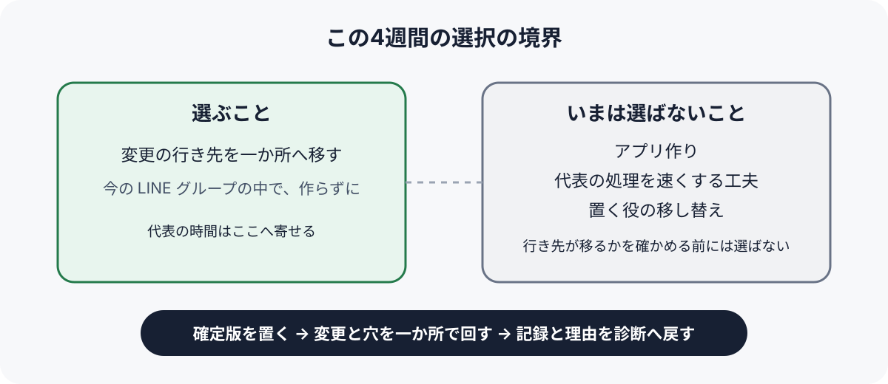
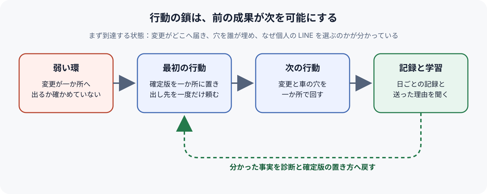

# Product Strategy — ひばりが丘FC のクラブの連絡

予定の変更が代表一人に集まる状態のうち、全体をいちばん強く止めているのは、保護者とコーチが変更を代表の個人の LINE ではなく全員の見える一か所へ出すかどうかが、まだ一度も確かめられていないことである。そこで次の4週間は何も作らず、今の LINE グループの中に予定の確定版の置き場所を一つ決め、変更の行き先をそこへ移すことに代表の時間を寄せる。

代表と、手伝いを申し出ている知り合いのエンジニアは、この文書で、2026-09-27 から4週間（2026-10-25 ごろまで）、クラブの連絡のために使う時間をどこへ寄せ、何に使わないかを決める。この期間の長さは代表が判断しておらず、推奨を仮に置いている（「未決」に書いた）。入力は [Product North Star](../upstream/north-star.md) と、前の段の[課題と価値仮説](../upstream/problem-hypothesis.md)、2026-09-27 に代表から聞いたことである。受益者、約束する価値、判断原則、担わない範囲（当番の割り振りと会費の集金を含む）はそのまま使い、変えるべきだと分かったら North Star へ差し戻す。確定版の文面や記録の付け方の細部は、代表が使いながら決める。

## 診断: 変更の行き先が移るかを確かめていないことが、全体を止めている

North Star が目指すのは、予定と変更が全員の見に行く一か所で回り、代表が試合の前夜に一人で組み直さずに眠れ、試合の日にコーチとしてグラウンドに立てる状態である。そこへ価値が届くまでには、四つの働きが順につながる。予定の確定版が一か所にあること、欠席や車の変更を本人がそこへ出すこと、それで空いた車の穴が全員に見えて代表以外が名乗り出ること、その結果として代表が前夜の組み直しと配り直しから外れることである。

いまはこの鎖のどこも成り立っていない。ただ、止まり方は同じではない。確定版の置き場所は、LINE のアナウンスやノートのように今の LINE グループの中に作れると前の段の資料は見込んでおり、作ること自体は代表一人でできる。これに対して、変更を本人がそこへ出すかどうかは、代表が作れるものではなく、保護者とコーチが選ぶことである。そして2026-09-19 の三家庭は、そろってグループではなく代表の個人の LINE を選んでいた。代表は、個人の LINE へ送るのをやめてほしいと保護者に頼んだことが一度も無い。車の穴を代表以外が埋めることは、変更が全員に見えて初めて起き得るので、その前の環が成り立たないうちは確かめようがない。

したがって、この期間の最重要課題は、変更の行き先が一か所へ移るかどうかを確かめ、移すことである。ここが全体を止めるもっとも弱い環であり、ここを外してアプリで確定版を見やすくしたり、代表の配車表の作り直しを速くしたりしても、変更が代表の個人の LINE に届く限り、前夜の組み直しは代表に残る。前の段の資料も、アプリが効くかどうかは、保護者がアプリへ変更を出すかに懸かっており、それは今の LINE グループでも確かめられる同じ前提だとしている。

### 観測したこと

2026-09-19（金）21時半すぎから23時ごろ、三家庭から欠席二件と車を出せなくなった一件が、別々に代表の個人の LINE へ届き、LINE グループには誰も書いていなかった。代表は23時すぎから一軒ずつ頼んで4軒目で引き受けてもらい、配車表を流し直したのは午前0時40分ごろだった。翌朝、流し直した表を見ていなかった家庭が1軒あり、出発が15分遅れた。（出典：代表の発言、観測時点：2026-09-27）

同じ夜の三家庭は、変更が起きたその夜のうちに連絡していた。返事が遅いのではなく、送り先が代表個人だった。また、車を出せる家庭は4軒目にいた。これは、変更を出してもらうことと車の穴を埋めてもらうことが、クラブの中でまったく望めないわけではないことを示す。（出典：代表の発言、観測時点：2026-09-27）

2026-09-08（火）の夜には、グループに流してあった集合時間を、コーチ1人と保護者2人が別々に代表の個人の LINE で聞き、代表はその夜およそ1時間半を連絡に使った。2026-08-23（日）には、個人の LINE に届いた問い合わせを代表が見落とし、練習中止を見ていなかった3家庭がグラウンドへ来た。（出典：代表の発言、観測時点：2026-09-27）

代表は個人の LINE で連絡してくるのをやめてほしいと保護者に頼んだことが無く、前の段の資料が提案した4週間の確かめもまだ始めていない。LINE グループは全家庭が入っており、代表は今後も使い続けるつもりである。（出典：grill での代表の回答、観測時点：2026-09-27）

使える資源は限られている。代表は会社員で平日の日中はクラブの連絡に時間を使えず、コーチは代表を含めて保護者のボランティア3人である。クラブのお金は年1万2千円の年会費だけで使い切っており、毎月の利用料は払えない。知り合いのエンジニアは週末に月数時間ほど手伝えると言っている。配車が要る遠征は月に2回ほどあり、練習試合か公式戦は月に2回ほど日曜にある。（出典：前の段の資料と grill での代表の回答、観測時点：2026-09-27）

### 現時点の見立て

確定版の置き場所を一つ決めて一度だけ頼めば、変更の半分以上が代表の個人の LINE ではなくそこへ届くようになる、と見立てる。これは仮説である。反証方法：前日18時以降から当日の出発までに、欠席と車の変更が決まった置き場所と代表の個人の LINE のどちらに何件届いたかを代表が日ごとに書き留め、4週間で半分以上が個人の LINE に届き続けたら、この見立ては崩れたとする。

車が足りなくなったことが決まった置き場所で全員に見えれば、代表が頼む前に名乗り出る家庭が出る、とも見立てる。反証方法：車の不足が起きた回に、代表が頼む前に誰かが名乗り出たかを記録する。誰も名乗り出なければ崩れたとする。4週間に車の不足が一度も起きなければ、確かめられないまま残る。

### まだ答えがない問い

保護者は、なぜ変更をグループではなく代表の個人の LINE へ送るのか。グループに書くのに気が引けるのなら、置き場所を決めて頼むだけで行き先が移るかもしれない。代表に確実に届けたいのなら、置き場所だけでは足りず、代表が見ていると分かる形が要る。この答えで、次の期間に置き場所の作り方を変えるのか、別の弱い環へ移るのかが変わる。確認先・方法：4週間のあいだに代表の個人の LINE へ変更を送った保護者に、その一回について、なぜ代表へ送ったのかを聞く。

## 基本方針

作る前に、行き先を移す。変更の出し先を、今の LINE グループの中の決まった一か所へ移すことだけに、この4週間の代表の時間を寄せる。保護者に新しい道具を入れてもらわず、お金もかけず、エンジニアの時間もまだ使わない。行き先が移ると分かれば、そのとき初めて、流れにくさや見に行かれなさといった、道具で解ける課題が次の弱い環として前に出てくる。

活かせる強みは三つある。LINE グループには全家庭が入っていて、代表は使い続けるつもりであること。2026-09-19 の三家庭が変更をその夜のうちに知らせていたこと。代表が遠征の配車表を自分で作ってグループに流しており、それを確定版の元にできることである。受け入れる制約は、年会費の範囲を超える費用が出せないこと、保護者に新しいアプリを入れてもらえないこと、代表が平日の日中に動けないこと、エンジニアの時間が月数時間であることである。この方針は、どの制約も越えずに弱い環へ直接働きかけられる。

### 集中すること

代表の時間を、試合や練習のたびに確定版を決まった一か所へ置くこと、変更と車の不足の出し先をそこだと一度だけ頼むこと、日ごとに記録を付けることに寄せる。確定版を置く手間は、今の配車表を作って流す手間と大きく変わらないと推定しているが、確かめていない。

配分の候補は、LINE グループの使い方を変える案と、エンジニアにアプリを作ってもらう案の二つを、同じ条件で比べた。条件は、期間を4週間、使えるのは代表の時間とエンジニアの月数時間、費用は無し、保護者に新しい道具は求めない、に揃えている。アプリの案は、確定版が流れず見やすくなる点で LINE グループより強い。それでも LINE グループの使い方を変える案に集中するのは、アプリも変更が本人から届かなければ働かず、その前提を確かめるのに作る必要が無いためである。月数時間では、4週間で保護者に使ってもらえる形まで作るのは難しいと推定しており、先に作ると、前提が崩れたときに作った物が無駄になる。

### やらないこと

次の三つには、この4週間、時間を配らない。どれも永久に選ばないという意味ではなく、変更の行き先が移るかが分かるまでは選ばないという選択である。三つとも代表が判断した選択ではない。一つ目は grill で推奨を仮置きしたもの、二つ目は North Star で仮置きされた判断原則に従ったもの、三つ目は問わずに置いた推奨である（一つ目と三つ目は「未決」に書いた）。

アプリは作らない。代表はもともと出欠アプリを作りたいと考えていたが、アプリが効くかどうかは、この期間に確かめる行き先の前提に懸かっている。エンジニアの時間は、4週間の記録を見てから使い道を決める。

代表が受けた変更を速く処理する工夫もしない。配車表の作り直しを速くする表の作り方などがこれに当たる。代表の処理が速くなっても行き先が代表のままなら前夜の組み直しは代表に残り、North Star の判断原則（連絡が代表を通らない側を選ぶ）とも合わない。

確定版を置く役を、代表からコーチなど別の人へ移すことも、この期間はしない。引き継げる回し方は North Star の目指す状態の一部だが、置く人まで同時に替えると、行き先が移らなかったときに原因が分けられなくなる。

### 方針を見直す条件

4週間で、前日18時以降から出発までの変更の半分以上が代表の個人の LINE に届き続けたら、診断を見直す。個人の LINE へ送った保護者に理由を聞き、置き場所の作り方の問題なのか、代表に確実に届けたいという別の理由なのかで、次の方針を選び直す。後者なら、North Star の約束する価値と役割にも見直しが要るので、戦略ではなく North Star の定め直しとして扱う。

変更の半分以上が決まった置き場所に届き、車の不足の回に一度でも名乗り出があれば、この弱い環は外れたとみなす。そのときは、見に行かない家庭が出ること、確定版を置く手間、置く役を代表以外へ渡せるかのどれが次に全体を止めているかを選び直し、エンジニアの時間をそこへ使うかをあわせて決める。

車の不足の回に代表が頼む前に誰も名乗り出なければ、車の穴を代表以外が埋めるという前提は崩れたとし、次の行動の後半（名乗り出を待つこと）を外して、穴を埋める役をどう移すかを別に考える。

## 一貫した行動

### 確定版を一か所に置き、出し先を一度だけ頼む

代表は、試合や練習のたびに、集合時間、場所、配車を載せた確定版を LINE グループの中の決まった一か所に一つだけ置く。置き場所はノートでその回ごとに作り、アナウンスでその回のノートを上に固定することを仮に置いている。そのうえで、「欠席と車の変更は、代表の個人の LINE ではなくこの投稿へ。車が足りなくなったら、出せる方は名乗り出てください」と一度だけ頼む。

この行動で初めて、変更を出す先が代表以外に生まれる。行き先が無いまま保護者に「個人の LINE へ送らないで」と言っても、送る先が無いので次の行動が成り立たない。最初の週の試合か練習の前に確定版が置かれ、頼む投稿が流れていれば前進したとする。

### 変更と車の穴を、決まった一か所で回す

欠席や車の変更がその一か所に書き込まれたら、代表はそこで確定版を直し、流し直さない。車が足りなくなったら、代表は一軒ずつ頼む前に、まずその一か所で不足を知らせて名乗り出を待つ。子どもの移動を止めないために、名乗り出が無ければ従来どおり代表が頼む。どこまで待つかは決めておらず、代表が回ごとに判断する。

変更が代表の個人の LINE に届いたら、代表は断らずに反映し、「次からは決まった投稿へお願いします」と一言だけ返す。これは代表が判断しておらず、推奨の仮置きである。断れば送り迎えに穴が空くおそれがあり、黙って処理し続ければ行き先が代表のまま固まるので、その間を取っている。

最初の行動で置き場所ができているから、この行動で変更と穴が全員に見える。変更が決まった一か所に届き、代表がその回の配車表を流し直さずに済んだ回が一度でもあれば前進したとする。

### 日ごとに記録し、個人の LINE を選んだ理由を聞く

代表は、前日18時以降から当日の出発までに、欠席と車の変更が決まった一か所と個人の LINE のどちらに何件届いたか、集合時間などの問い合わせが個人の LINE に何件来たか、車が足りなくなったときに誰が埋めたか、前日に配車表を作り直したかを日ごとに書き留める。4週間の終わりに、個人の LINE へ変更を送った保護者に、その一回でなぜ代表へ送ったのかを聞く。

前の二つの行動が無ければ、比べる数も聞く相手も生まれない。記録と理由は、「方針を見直す条件」のどれに当たるかを決める材料になり、確定版の置き方と頼み方を直す手がかりとして最初の行動へ戻る。

### 行動のつながり

確定版の置き場所ができるから、変更と車の穴をそこで回せる。そこで回した回と回せなかった回があるから、記録で行き先が移ったかを数え、個人の LINE を選んだ保護者に理由を聞ける。その理由は、置き場所の作り方と頼み方を直すか、別の弱い環へ移るかを決める材料として、最初の行動へ戻る。どれか一つを外すと、ほかの二つは意味を失う。

### まず到達する状態

2026-10-25 ごろ、4週間の記録から、前日18時以降の変更が決まった一か所と代表の個人の LINE にどれだけの割合で届いたか、車の不足の回に代表が頼む前に名乗り出があったか、保護者がなぜ個人の LINE を選ぶのかが、代表に説明できる状態に着く。これは今の LINE グループと代表の時間だけで手が届く。この状態に着けば、行き先がまだ動かないのか、動いた先で見に行かれないことや置く手間や置く役の引き継ぎが次に全体を止めるのかが見え、エンジニアの時間をどこへ使うかを決められる。

## 未決

### この戦略の期間を4週間に区切ってよいか（仮置き）

期間を 2026-09-27 から4週間（2026-10-25 ごろまで）に仮に置いた。根拠は、最重要の前提が前の段の資料の4週間の確かめで分かり、遠征が月に2回ほどあれば、その間に配車の回が2回ほど入ることである。採らなかった案は、アプリを作るところまで含めて数か月の配分を決める案で、確かめる前に作るものまで決めることになるので採らなかった。代表は「考えたことが無く分からない」と答え、推奨を仮置きした。確認先・方法：代表に改めて判断してもらう。

### この期間、アプリ作りを見送ってよいか（仮置き）

エンジニアにアプリを作ってもらうのを、この4週間は見送ると仮に置いた。根拠は、アプリが効くかどうかが変更の行き先の前提に懸かり、その前提は作らずに確かめられること、月数時間では4週間で使える形まで作るのは難しいと推定することである。採らなかった案は、依頼どおり出欠アプリを並行して作り始める案である。代表は、アプリを作りたいとは思っているが、見送ってよいかは「分からない」と答え、推奨を仮置きした。確認先・方法：代表とエンジニアに改めて判断してもらう。

### 個人の LINE に届いた変更へどう返すか（仮置き）

受け取った変更は断らずに反映し、決まった投稿へ一言だけ促すと仮に置いた。根拠は、断れば送り迎えに穴が空くおそれがあり、黙って処理すれば行き先が代表のまま固まることである。採らなかった案は、個人の LINE では受け付けない案と、何も言わずに処理し続ける案である。代表は、保護者に頼んだことが無く「分からない」と答え、推奨を仮置きした。確認先・方法：代表に改めて判断してもらう。一言返すことで保護者との関係に気まずさが出たら見直す。

### 確定版をどこに置くか（問わずに仮置き）

LINE のノートにその回ごとの確定版を作り、アナウンスで上に固定すると仮に置いた。根拠は、どちらの置き方でも最重要課題と捨てる選択が変わらず、使ってみて見に行かれない方を替えれば足りることである。採らなかった案は、アナウンスだけに書く案である。代表には問うておらず、合意も得ていない。確認先・方法：最初の2回を置いてみて、確定版を見ずに問い合わせてくる人がいたかで判断する。

### 確定版を置く役を、この期間は代表が持つか（問わずに仮置き）

この4週間は代表が確定版を置くと仮に置いた。根拠は、置く人まで同時に替えると、行き先が移らなかったときに原因が分けられないことである。採らなかった案は、最初からコーチに置く役を渡し、引き継げる回し方も同時に確かめる案である。代表には問うておらず、合意も得ていない。確認先・方法：代表に問う。

### 次の4週間の配車の日付

配車が要る遠征は月に2回ほどあると分かっているが、この先の具体的な日付は代表が覚えていなかった。車の不足が一度も起きなければ、名乗り出の前提は確かめられないまま残る。確認先・方法：代表の予定表で遠征と試合の日付を確かめ、記録を付ける日に入れる。
